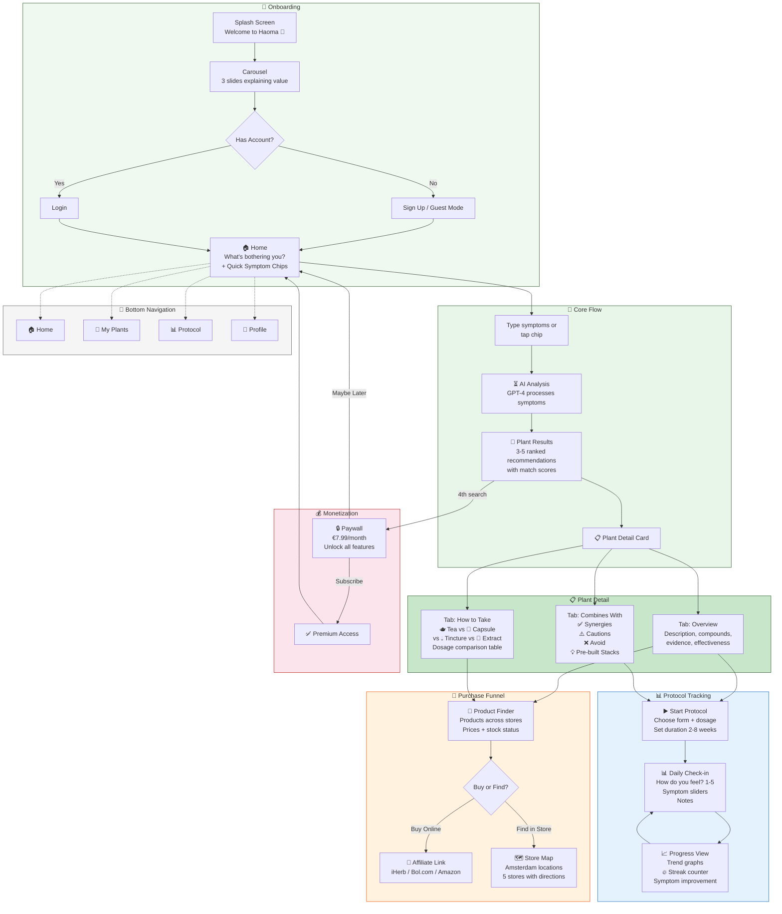
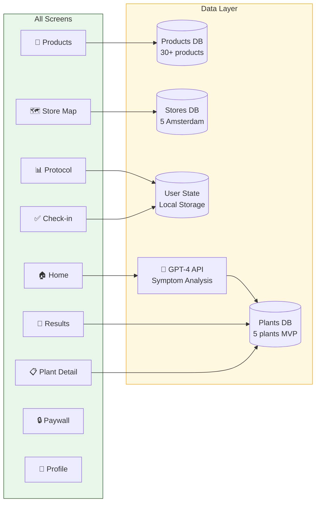
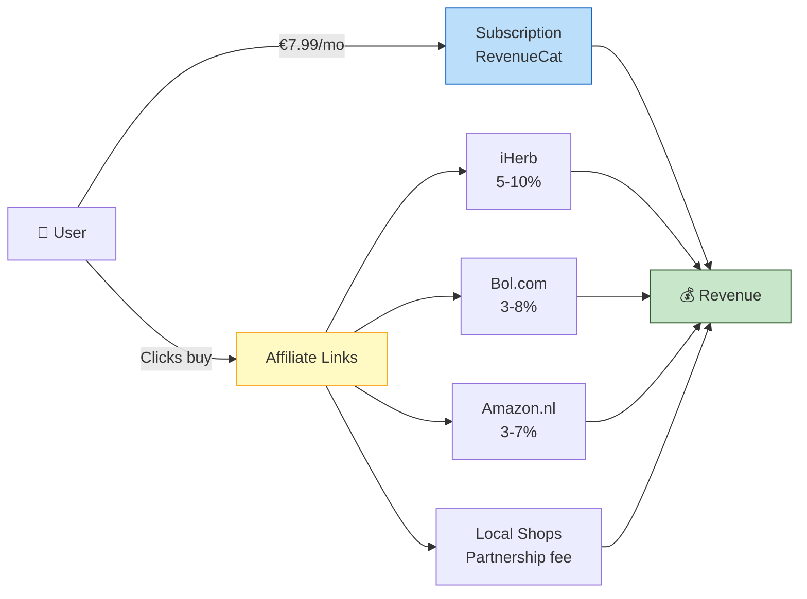

# 🌿 Haoma — App Diagram

## User Flow

```mermaid
flowchart TD
    subgraph ONBOARDING["🚀 Onboarding"]
        A[Splash Screen<br/>Welcome to Haoma 🌿] --> B[Carousel<br/>3 slides explaining value]
        B --> C{Has Account?}
        C -->|No| D[Sign Up / Guest Mode]
        C -->|Yes| E[Login]
        D --> F[Home]
        E --> F
    end

    subgraph CORE["🌿 Core Flow"]
        F[🏠 Home<br/>What's bothering you?<br/>+ Quick Symptom Chips] --> G[Type symptoms or<br/>tap chip]
        G --> H[⏳ AI Analysis<br/>GPT-4 processes symptoms]
        H --> I[🌿 Plant Results<br/>3-5 ranked recommendations<br/>with match scores]
        I --> J[📋 Plant Detail Card]
    end

    subgraph DETAIL["📋 Plant Detail"]
        J --> K[Tab: Overview<br/>Description, compounds,<br/>evidence, effectiveness]
        J --> L[Tab: How to Take<br/>🫖 Tea vs 💊 Capsule<br/>vs 💧 Tincture vs 🧪 Extract<br/>Dosage comparison table]
        J --> M[Tab: Combines With<br/>✅ Synergies<br/>⚠️ Cautions<br/>❌ Avoid<br/>💡 Pre-built Stacks]
    end

    subgraph PURCHASE["🛒 Purchase Funnel"]
        K --> N[🛒 Product Finder<br/>Products across stores<br/>Prices + stock status]
        L --> N
        N --> O{Buy or Find?}
        O -->|Buy Online| P[🔗 Affiliate Link<br/>iHerb / Bol.com / Amazon]
        O -->|Find in Store| Q[🗺️ Store Map<br/>Amsterdam locations<br/>5 stores with directions]
    end

    subgraph TRACKING["📊 Protocol Tracking"]
        K --> R[▶️ Start Protocol<br/>Choose form + dosage<br/>Set duration 2-8 weeks]
        M --> R
        R --> S[📊 Daily Check-in<br/>How do you feel? 1-5<br/>Symptom sliders<br/>Notes]
        S --> T[📈 Progress View<br/>Trend graphs<br/>🔥 Streak counter<br/>Symptom improvement]
        T --> S
    end

    subgraph PAYWALL["💰 Monetization"]
        I -->|4th search| U[🔒 Paywall<br/>€7.99/month<br/>Unlock all features]
        U -->|Subscribe| V[✅ Premium Access]
        U -->|Maybe Later| F
        V --> F
    end

    subgraph NAV["📱 Bottom Navigation"]
        F -.-> W[🏠 Home]
        F -.-> X[🌿 My Plants]
        F -.-> Y[📊 Protocol]
        F -.-> Z[👤 Profile]
    end

    style ONBOARDING fill:#f0f9f0,stroke:#2d5a2d
    style CORE fill:#e8f5e9,stroke:#2d5a2d
    style DETAIL fill:#c8e6c9,stroke:#2d5a2d
    style PURCHASE fill:#fff3e0,stroke:#e65100
    style TRACKING fill:#e3f2fd,stroke:#1565c0
    style PAYWALL fill:#fce4ec,stroke:#b71c1c
    style NAV fill:#f5f5f5,stroke:#616161
```

## Screen Architecture

```mermaid
graph LR
    subgraph SCREENS["All Screens"]
        S1[🏠 Home]
        S2[🌿 Results]
        S3[📋 Plant Detail]
        S4[🛒 Products]
        S5[🗺️ Store Map]
        S6[📊 Protocol]
        S7[✅ Check-in]
        S8[🔒 Paywall]
        S9[👤 Profile]
    end

    subgraph DATA["Data Layer"]
        D1[(Plants DB<br/>5 plants MVP)]
        D2[(Products DB<br/>30+ products)]
        D3[(Stores DB<br/>5 Amsterdam)]
        D4[(User State<br/>Local Storage)]
        D5[🤖 GPT-4 API<br/>Symptom Analysis]
    end

    S1 --> D5
    D5 --> D1
    S2 --> D1
    S3 --> D1
    S4 --> D2
    S5 --> D3
    S6 --> D4
    S7 --> D4

    style SCREENS fill:#e8f5e9,stroke:#2d5a2d
    style DATA fill:#fff8e1,stroke:#f9a825
```

## Revenue Flow

```mermaid
flowchart LR
    U[👤 User] -->|€7.99/mo| SUB[Subscription<br/>RevenueCat]
    U -->|Clicks buy| AFF[Affiliate Links]
    AFF --> IH[iHerb<br/>5-10%]
    AFF --> BOL[Bol.com<br/>3-8%]
    AFF --> AMZ[Amazon.nl<br/>3-7%]
    AFF --> LOCAL[Local Shops<br/>Partnership fee]
    
    SUB --> REV[💰 Revenue]
    IH --> REV
    BOL --> REV
    AMZ --> REV
    LOCAL --> REV

    style REV fill:#c8e6c9,stroke:#2d5a2d
    style SUB fill:#bbdefb,stroke:#1565c0
    style AFF fill:#fff9c4,stroke:#f9a825
```
